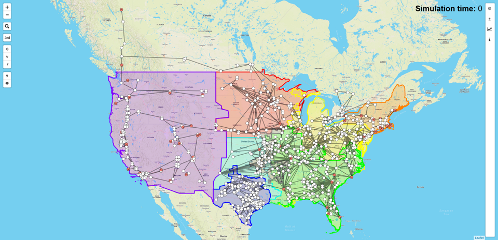

AGVis is a geovisualization tool that facilitates the visualization of ***large-scale real-time*** power system simulation.

It is developed to enable geographical interpretation of power system simulation results. Further, the enhanced AGVis allows not only for real-time visualization for data coming from ANDES, but also for independent use with user-defined data.

AGVis visualizing the entire North America system
