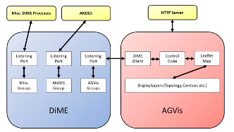

DiME is a data exchange environment for enabling high-concurrency, high-volume real-time data exchange in ***large-scale real-time*** power system simulations. Using a shared workspace, DiME allows multiple clients in different programming languages.

A component diagram of the interactions between ANDES, DiME, and AGVis

Although DiME is primarily meant to be used as a messaging environment for distributed computing, it also has uses as a simple way to pass data between programs of different languages. This is best shown when running base AGVis with ANDES. When they start, AGVis and ANDEs both connect to a DiME server if one is available. Then, as shown in the figure, DiME acts as an intermediary between them. ANDES sends data to the group that AGVis has joined, and AGVis waits until data is sent to it. Then AGVis animates the simulation based on the data it receives.
