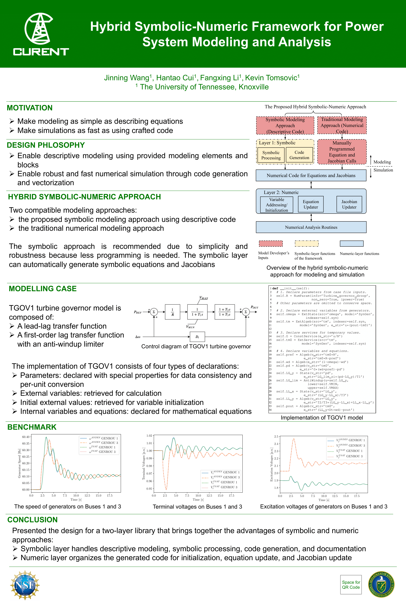

ANDES is an open-source Python library for power system modeling, computation, analysis, and control. It supports power flows calculation, transient stability simulation, and small-signal stability analysis for transmission systems. ANDES implements a symbolic-numeric framework for rapid prototyping of differential-algebraic equation-based models. In this framework, a comprehensive [library of models](https://docs.andes.app/en/latest/modelref.html#modelref) is developed, including the full second-generation renewable models. Models in ANDES have been [verified](https://docs.andes.app/en/latest/getting_started/verification.html#verification) with commercial software.

ANDES is the dynamic simulation engine for the CURENT Largescale Testbed (LTB).

